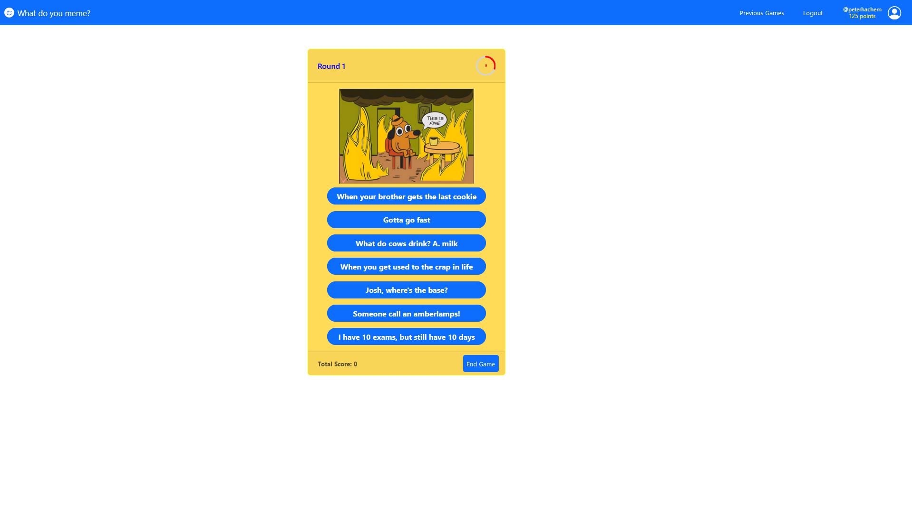
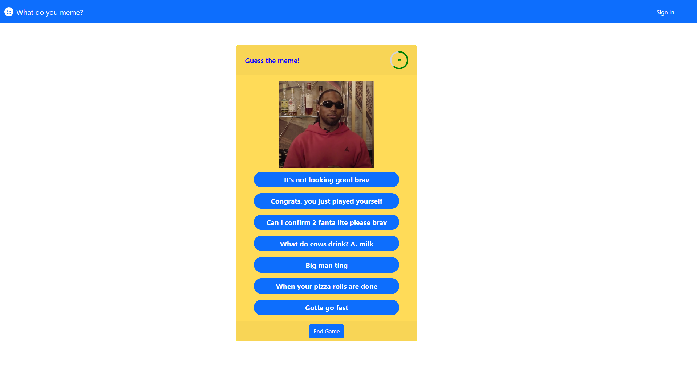

# "What do you Meme?"

## Badges


## React Client Application Routes

- Route `/`: it contains the homepage of the React application. The main purpose of this page is to display the game component for the user to play. If the user is not authenticated, he is allowed to play only one round, otherwise, he is allowed to play a game of three rounds.
  A top navbar allows to navigate through the different routes of the application and it shows (if any) the user's username and the total score of all his games.
- Route `/login`: it contains the login page of the application, showing a form to log in the user, and the top navbar to navigate through the different routes of the application. In the case of logged-in users, They are redirected to the home page.
- Route `/games`: it contains the full history of all the games of the current user. The history is displayed from recent games to old games. A the top navbar to navigate through the different routes of the application. This page is only available for loggedIn users.

## Main React Components

- `App` (in `App.jsx`): the main component of the application; it wraps all the other components in a '`Router`' component (which is responsible for the routing of the application) and in three '`ContextProvider` components', that provide the context data of the application (`user`, `errorMessage` and `successMessage`).

  - `MemeNavbar` (in `/components/MemeNavbar.jsx`): The navigation bar of the application; it contains the diverse navigation links for the user to click on: the title of the navbar redirects to the home page, the login(logout) button redirects to the login(home) page and if the user is logged he has access to the history of all the games through the "Previous Game" button.
  - `LoginPage` (in `routes/LoginPage.jsx`): It verifies the user's authentication and, if unsuccessful, displays the Login Page with the specified layout; otherwise, it redirects the user to the home page.
    - `LoginForm` (in `components/LoginForm.jsx`): This component includes the login form with the necessary input fields for username and password. Upon clicking the 'login' button, it validates the provided credentials and redirects the user to the home page if the login is successful. Additionally, it features a 'Continue as guest' button that allows users to proceed to the home page without logging in.
  - `Home` (in `routes/Home.jsx`): The index page that is in charge of letting the user play a game. It checks if there is user present during the current session and in this case, it computes the total score of all games which is then, displayed under the username in the navigation bar.
    In the case, of an authenticated user that is passed by the `userContext` parameter the following components is displayed:

    - `UserMemeForm` (in `components/UserMemeForm.jsx`): This component lets the authenticated user to play a game: An alert message is displayed after each round to display if the user has correctly responded to a question or not. At the end of the game, the user is prompted by a message that indicates the correct answers that he was able to answer.

    Otherwise, if the user is not authenticated, the following component is displayed:

    - `MemeForm` (in `components/MemeForm.jsx`): This component lets the non-authenticated user to play a single round game: A message is displayed if the user decides to responds wrongly, end the game or in the case of running out of time. If the user answers correctly, a 'Guess another meme' button appears where he can guess another meme.

  In both cases, all the main APIs functions required are passed by from top to bottom.

  - `HistoryPage` (in `routes/HistoryPage.jsx`): this page displays the full history of an authenticated user, from newest to oldest. On page load, the userEffect checks if the current session is the one by the authenticated user and then fetches the full history of the authenticated user based on its id.
    - `HistoryForm` (in `components/HistoryForm.jsx`): this components is in charge of displaying the history of the authenticated user.

## API Server

### Authentication APIs

- **GET `/api/sessions/current`**

  - **Description**: Returns the current session of the user, if any.
  - **Response Body**: A JSON object containing the user's id and username.

- **POST `/api/login`**

  - **Description**: Logs in the user if the provided username and password are correct, creating a new session.
  - **Request Body**: A JSON object containing the username and password entered by the user.
  - **Response Body**: A JSON object containing the user's id and username if the login is successful, or an object with an error message otherwise.

- **DELETE `/api/logout`**
  - **Description**: Logs out the user, destroying the current session.
  - **Request Body**: _None_.
  - **Response Body**: _None_ if the logout is successful, or an object with an error message otherwise.

### Memes APIs

- **GET `/api/memes/`**

  - **Description**: Retrieves a random meme from the database with some random captions.
  - **Request Body**: _None_.
  - **Response Body**: Returns an object with two keys: _meme_ with the corresponding id and url of the chosen meme and _captions_ an array of captions.

    Example of the response body:

    ```json
    {
      "meme": [
        {
          "id": 6,
          "url": "meme6.jpg"
        }
      ],
      "captions": [
        {
          "caption": "When your brother gets the last cookie"
        },
        {
          "caption": "In the morning, I have fish and a rice cake"
        },
        {
          "caption": "Me waiting for my girlfriend to get ready"
        },
        {
          "caption": "Anitta Max Win"
        },
        {
          "caption": "They got us in the first half, not gonna lie"
        },
        {
          "caption": "It's not looking good brav"
        },
        {
          "caption": "Wait a minute, who are you?"
        }
      ]
    }
    ```

- **POST `/api/memes/verify`**

  - **Description**: Performs a verfication if the selected answer is correct or not.
  - **Request Body**: object containing meme_id and answer
  - **Response Body**: object containing _isCorrect_ a boolean value indicating whether it is correct or not.

  Example of the request body:

  ```json
  [
    {
      "meme_id": 5,
      "answer": "Hello"
    }
  ]
  ```

  Example of the response body:

  ```json
  {
    "isCorrect": false
  }
  ```

- **POST `/api/memes/correct`**

  - **Description**: fetch the correct captions based on the captions present and the meme_id.
  - **Request Body**: object containing the meme_id as an integer and the captions used for the round as an array
  - **Response Body**: object containing the array of correct captions.

    Example of the request body:

    ```json
    {
      "meme_id": 5,
      "selected_captions": [
        {"caption": "Wait a minute, who are you" },
        { "caption": "Just sleep"},
        {"caption": "don't sleep"},
        { "caption": "you can do it"},
        { "caption": "you are doing okay"},
        { "caption": "You on Kazoo" }
        { "caption": "You are close to the end"}
      ]
    }
    ```

    Example of the response body:

    ```json
    {
      "captions": [
        { "caption": "Wait a minute, who are you?" },
        { "caption": "You on Kazoo" }
      ]
    }
    ```

- **POST `/api/memes/game/`** -**Description**: Insert the results of the game upon completion. -**Request Body**: Object containing the user*id as an int, memes as an array of strings and score as an array of integers. -**Response Body**: \_None*, success or failure of the insert operation.

  Example of the request body:

  ```json
  {
    "user_id": 5,
    "memes": ["url1", "url2", "url3"],
    "scores": [5, 0, 5]
  }
  ```

### History API

- **GET `/api/history/:userId`**

  - **Description**: Retrieve the history of all the games of a certain user.
  - **Request Parameter**: userID, the id of the user to retrieve the history.
  - **Response Body**: object containing all the games of all the users.

## Database Tables

- Table `User` - short description of its contents
- Table `Meme` - contains all the memes represented as URLs. (id\*, url)
- Table `Captions` - contains all the captions represented as texts. (id\*, text)
- Table `Middle` - Junction table that handles the many-to-many relationship between table `Meme` and table `Captions`. (id\*, caption_id, meme_id)
- Table `Game` - contains all the games played by each user with their relative score. (id\*, user_id, memes, scores)

  (Remark: the implementation of both memes and scores are both in fact arrays that are stored within a text for computation efficiency).

\*table's Primary Key

## Screenshots





## Users Credentials

- michaelcole, password1 (games already available)
- peterhachem, password2 (games already available)
- bryancook, password3 (no games played)
